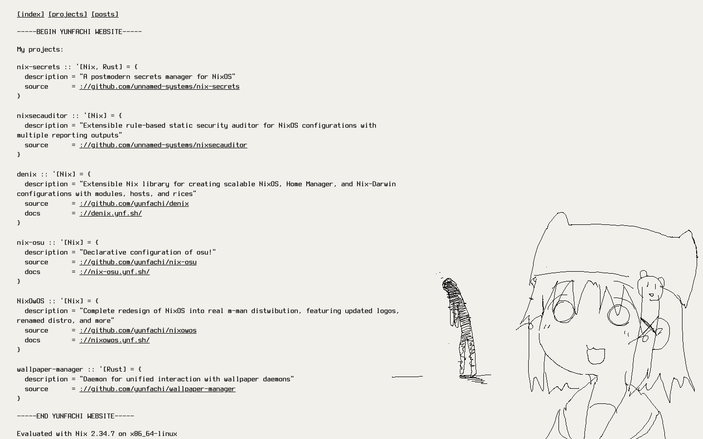
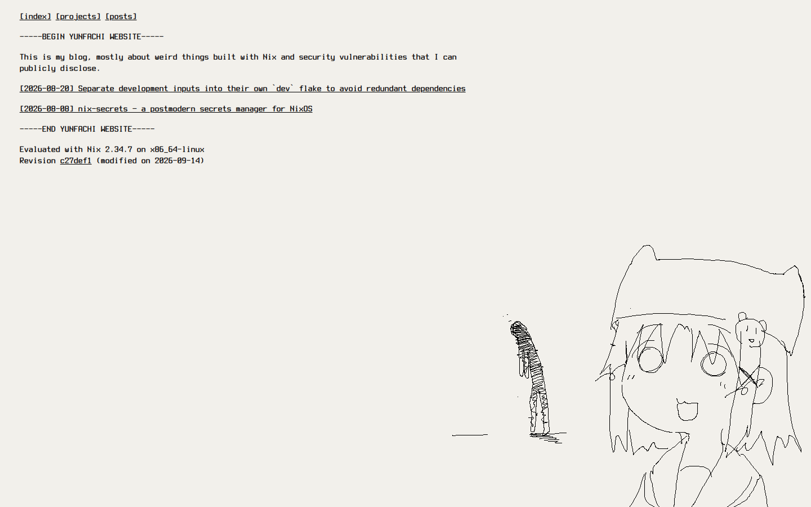
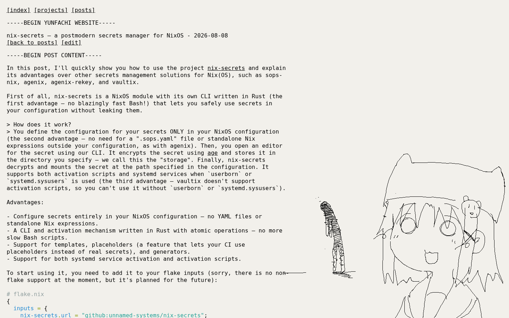
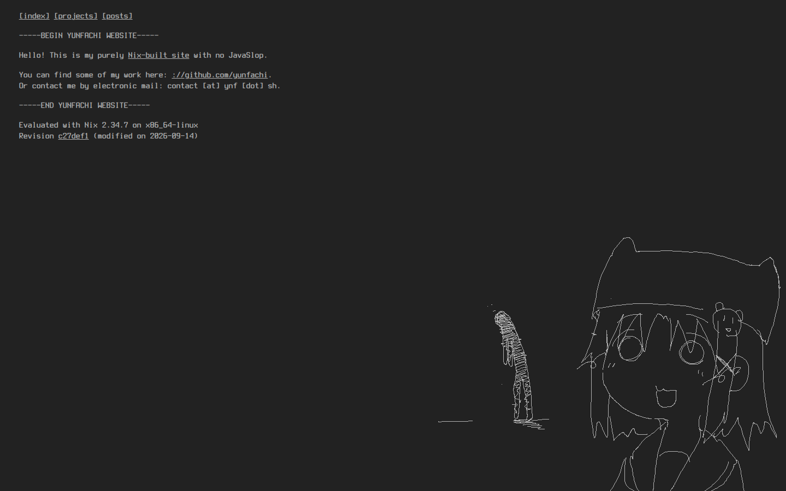
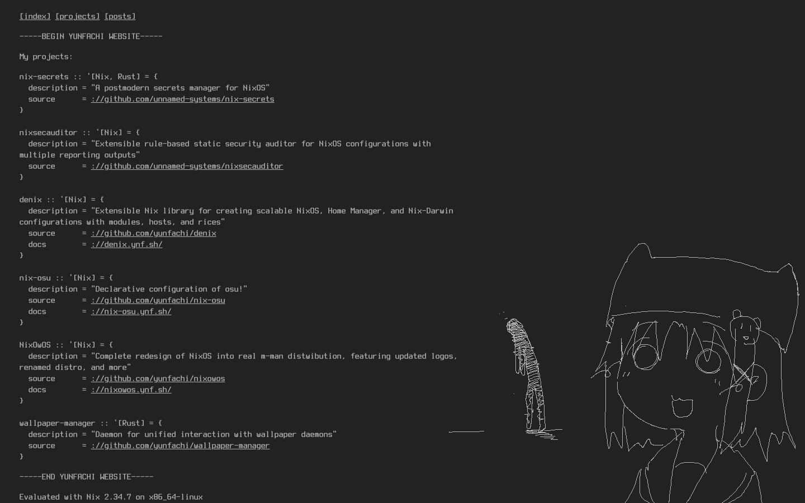
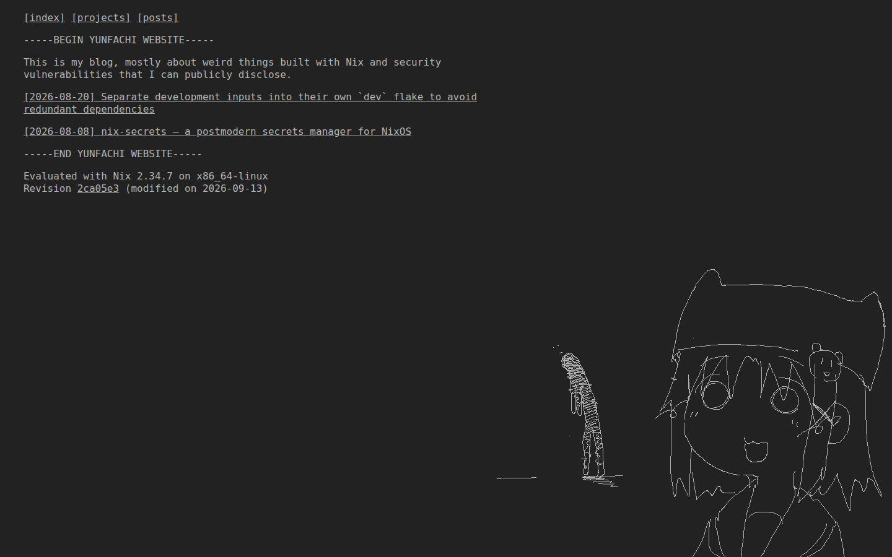
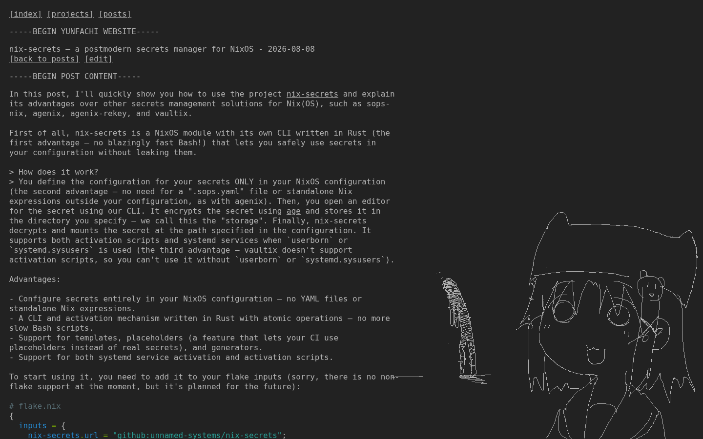

# ynf.sh

My personal website, built with Nix and no JavaSlop.

Just open it: https://ynf.sh/

<p align="center">
  <a href="https://ynf.sh/"></a>
  <a href="https://ynf.sh/projects"></a>
  <a href="https://ynf.sh/posts"></a>
  <a href="https://ynf.sh/posts/nix-secrets-a-postmodern-secrets-manager-for-nixos"></a>
</p>
<p align="center">
  <a href="https://ynf.sh/"></a>
  <a href="https://ynf.sh/projects"></a>
  <a href="https://ynf.sh/posts"></a>
  <a href="https://ynf.sh/posts/nix-secrets-a-postmodern-secrets-manager-for-nixos"></a>
</p>

## Build

```sh
nix build .#site
```

The generated website will be available in `result/`.

## License

The source code is licensed under the GPLv3.
